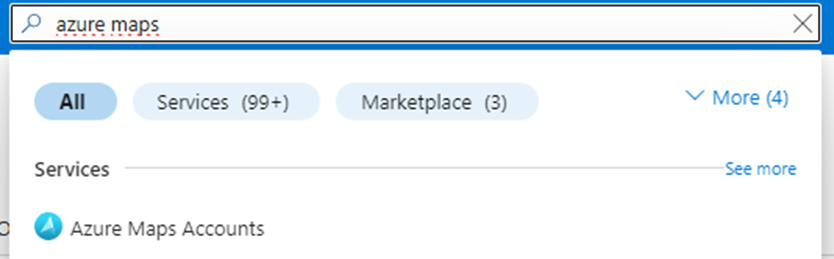
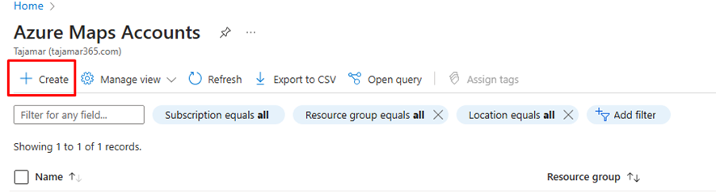
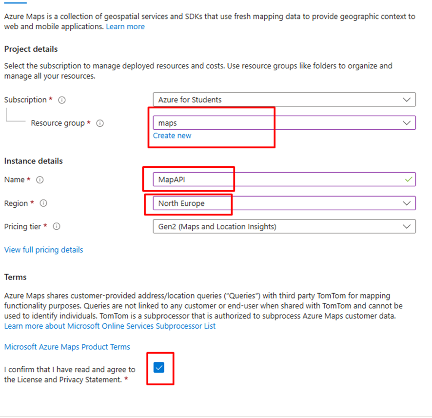
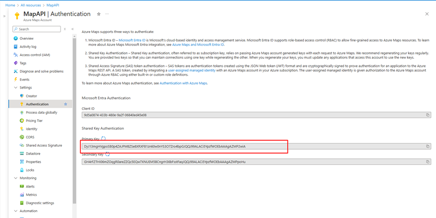

# Proyecto: Simulador de Rutas de Vehículos con Azure Maps

## Descripción
Este proyecto utiliza la API de Azure Maps para simular rutas de vehículos en tiempo real. El programa genera una ruta desde un punto inicial a uno final, obteniendo información sobre los puntos de la ruta y calculando datos como elevación, distancia, velocidad y tiempo. Los datos se guardan en un archivo JSON para su posterior análisis.

---

## Creación de una Cuenta de Azure Maps

### Pasos para Crear una Cuenta de Azure Maps

1. **Entrar en Azure Portal**  

   Accede al portal de Azure a través de [Azure Portal](https://portal.azure.com).

2. **Buscar Azure Maps Accounts** 

   En el buscador, escribe `Azure Maps Accounts` y selecciona la opción correspondiente.

   

3. **Crear una Nueva Cuenta**  
   Haz clic en el botón `Create` para iniciar la creación de una cuenta de Azure Maps.

   

4. **Configuración del Recurso**  
   - Si no tienes un grupo de recursos, crea uno nuevo.
   - Introduce un nombre para la cuenta y selecciona la región deseada.
   - Asegúrate de marcar la casilla de licencia para aceptar los términos.

   

5. **Finalizar la Creación**  
   Una vez configurados los parámetros, haz clic en `Create`. Azure comenzará a implementar tu cuenta.

6. **Obtener la Primary Key**  
   - Accede al recurso recién creado.
   - Ve a la sección `Authentication`.
   - Copia la **Primary Key**. Esta clave será necesaria para incluirla en tu script y llamar a la API de Azure Maps.

   

### Nota Importante
Guarda la **Primary Key** de forma segura, ya que será esencial para interactuar con la API de mapas.


### Dependencias
- Python 3.8 o superior
- Librerías necesarias:
  - `requests`
  - `json`
  - `random`
  - `datetime`
  - `geopy`

### Instalación del Entorno Virtual
1. Crear un entorno virtual:
   ```bash
   python -m venv venv
   ```
2. Activar el entorno virtual:
   - En Windows:
     ```bash
     venv\Scripts\activate
     ```
   - En macOS/Linux:
     ```bash
     source venv/bin/activate
     ```
3. Instalar las dependencias:
   ```bash
   pip install requests geopy
   ```

---

## Uso

### Configuración
1. Reemplaza el valor de `api_key` con tu clave de suscripción de Azure Maps.
2. Define las coordenadas de inicio y fin en las variables:
   ```python
   start_lat = 40.397667314975536
   start_lon = -3.6496011457469146
   end_lat = 40.490252679705584
   end_lon = -3.650522047596679
   ```
3. Define el identificador del vehículo en `car_id` (opcional).

### Ejecución
1. Ejecuta el script:
   ```bash
   python script.py
   ```
2. Los resultados se imprimirán en la consola y se guardarán en un archivo JSON llamado `azure_taxi_route_data.json`.

---

## Estructura del Archivo JSON
Cada punto de la ruta se guarda con los siguientes datos:

- `car_id`: Identificador del vehículo.
- `latitude`: Latitud del punto.
- `longitude`: Longitud del punto.
- `elevation`: Elevación simulada en metros.
- `timestamp`: Marca de tiempo que incrementa cada segundo.
- `distance_km`: Distancia desde el punto anterior en kilómetros.

### Ejemplo de Salida
```json
[
    {
        "car_id": "VIKUNETA",
        "latitude": 40.397667,
        "longitude": -3.649601,
        "elevation": 121.5,
        "timestamp": "0:00:01",
        "distance_km": 0.0
    },
    {
        "car_id": "VIKUNETA",
        "latitude": 40.398234,
        "longitude": -3.650123,
        "elevation": 122.3,
        "timestamp": "0:00:02",
        "distance_km": 0.543
    }
]
```

---

## Estructura del Código

### 1. **`get_route_from_azure_maps`**
Obtiene los puntos de la ruta desde la API de Azure Maps y calcula el tiempo total estimado del trayecto.

### 2. **`generate_taxi_route`**
Genera una simulación de la ruta calculando:
- Latitud y longitud para cada punto.
- Elevación simulada.
- Marca de tiempo incrementada por segundo.
- Distancia entre puntos usando `geopy`.

### 3. **Flujo Principal**
- Define los puntos inicial y final.
- Genera la ruta del taxi.
- Guarda los datos en un archivo JSON.

---

## Notas
- Asegúrate de tener una suscripción activa a Azure Maps para obtener una clave de API válida.
- La elevación y la velocidad se simulan y no representan datos reales.
- Revisa las limitaciones de la API de Azure Maps para evitar exceder las cuotas.

---

## Problemas Comunes

### 1. **Error: `NameError: name 'geodesic' is not defined`**
Asegúrate de haber instalado la librería `geopy` y haberla importado correctamente:
```python
from geopy.distance import geodesic
```

### 2. **Error de Autenticación**
Verifica que el `api_key` sea válido y tenga permisos para acceder a Azure Maps.

---

## Contacto
Para cualquier consulta o mejora, contacta con el desarrollador a través de tu correo electrónico preferido.

[Siguiente: Desplegar **Azure Event Hubs** y configurar los productores y consumidores de datos.](../02-eventhubs/README.md)
