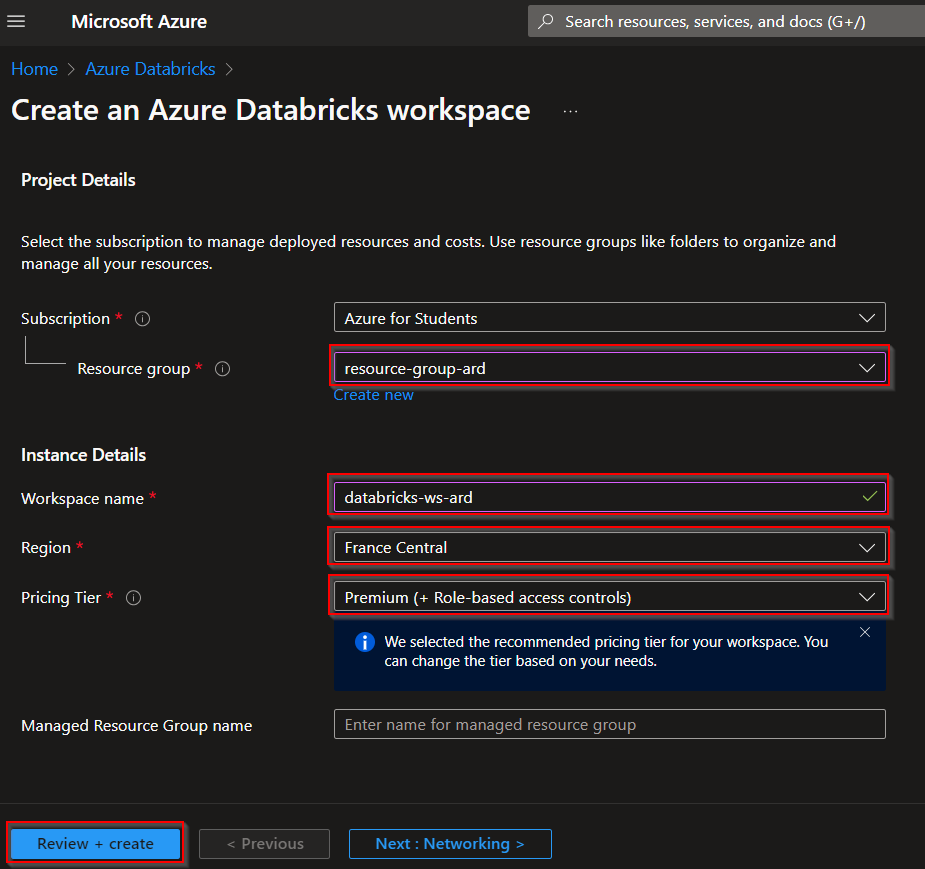

# Databricks

## Creación de un clúster en Azure Databricks y configuración para Azure Event Hubs

Este documento detalla cómo crear un clúster de Azure Databricks con un solo nodo en una suscripción Premium, e instalar la librería necesaria para recibir datos de un Event Hub. Después de realizar estas configuraciones, se creará un Notebook para trabajar los datos recibidos por el Event Hub sobre el almacenamiento, y se aplicarán transformaciones a los datos por _tiers_ (_bronze_, _silver_ y _gold_), antes de ser enviados a Power BI.

## 1️⃣: Crear un Workspace de Azure Databricks

1. Ir al portal de [Azure](https://portal.azure.com/).
2. Buscar **Databricks** en la barra de búsqueda y seleccionar **Azure Databricks**.
   
3. Hacer *click* en **Crear**.
   
4. Rellenar los campos necesarios:
   - **Resource Group:** Seleccionar un grupo existente o crear uno nuevo.
   - **Workspace Name:** Escribir un nombre único para el workspace.
   - **Pricing Tier:** Seleccionar **Premium**.
5. Hacer *click* en **Review + Create** y luego en **Create**.
   
   

## 2️⃣: Crear un clúster de Databricks con un solo nodo

1. Entrar al *Workspace* de Azure Databricks creado previamente.
   
   
2. En la barra lateral izquierda, ir a **Compute** y hacer *click* en **Create compute**.
   
   
3. Configurar el clúster:
   - **Cluster Name:** Asignar un nombre único.
   - **Cluster Mode:** Seleccionar **Single Node**.
   - **Databricks Runtime Version:** Elegir la versión más reciente compatible con **Event Hub**, como `15.4 LTS (Scala 2.12, Spark 3.5.0)` o similar.
   - **Node Type:** Escoger un tipo de nodo económico (por ejemplo, `Standard_DS3_v2`).
   - **Auto Termination:** Configurar el tiempo de inactividad para apagar automáticamente el clúster (opcional).
4. Hacer *click* en **Create compute**.
   
   

## 3️⃣: Instalar la librería para Azure Event Hub

1. Asegurarse de que el clúster esté en estado **Running** y seleccionarlo desde la pestaña **Compute**.
   
   
2. Ir a la pestaña **Libraries** y hacer *click* en **Install New**.
   
   
3. Configurar la instalación de la librería:
   - **Library Source:** Seleccionar **Maven**.
   - **Coordinates:** Ingresar las coordenadas del paquete *Maven* necesario:
     ```
     com.microsoft.azure:azure-eventhubs-spark_2.12:2.3.22
     ```
4. Hacer *click* en **Install**.
   
5. Verificar la instalación.
   

## 4️⃣: Crear o importar un Notebook

Importar el **Notebook** adjunto en este repositorio, con el nombre `<nombre_del_notebook>.ipynb`, o crear uno nuevo.

Para importar un **Notebook**:

1. En la barra lateral izquierda, ir a **Workspace**.
2. En el menú superior derecho, hacer *click* en el icono de los tres puntos, que abrirá un menú desplegable.
3. Hacer *click* en **Import** y seleccionar el archivo `.ipynb` (el **Notebook** a importar).
   

Para crear un nuevo **Notebook**:

1. También desde la sección **Workspace**, hacer *click* en **Create**.
2. Hacer *click* en **Notebook**.
   

## 5️⃣: Automatización de procesos (extra)

Si queremos tener más automatización en nuestro proceso de limpieza y mejora de los datos con Databricks, podemos crear un *workflow* que se ejecute constantemente. Para ello, seguiremos los siguientes pasos:

- 1- Nos dirijimos a la pestaña de **workflows** o **flujos de trabajo** en nuestro área de trabajo de Databricks.
   
   
- Seleccionamos la opción crear trabajo.

   

- Configuramos nuestro nuevo trabajo, añadiendo un nombre, configurando que lea el cuaderno creado e instalando la librería anteriormente mencionada

   

- Establecemos un trigger, en este caso será continuo para que no pare de escuchar eventos del EventHubs

   

Una vez guardado el trigger, ya tendríamos nuestro workflow corriendo para que se ejecute el cuaderno continuamente, y así poder automatizar las funciones de limpieza y agregación de los datos.

[Siguiente: Crear dashboards en **Power BI Desktop** y publicarlos en **Power BI Service**.](../05-powerbi/readme.md)