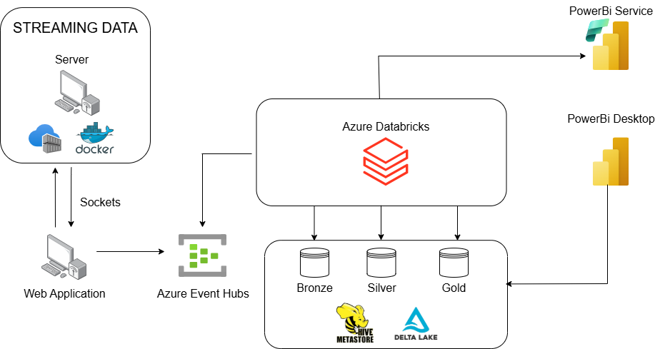

# End-to-end Streaming Data Project

## Descripción General

Esta arquitectura permite el procesamiento en tiempo real de datos provenientes de un servidor de streaming, con almacenamiento, transformación y visualización de los resultados en Power BI. Utiliza servicios y tecnologías de Azure para gestionar el flujo de datos de manera escalable y eficiente.

---

## Componentes Principales

### 1. **Streaming Data**
   - **Server**: Origen de los datos de streaming.
   - **Docker**: Contenedor que alberga la aplicación de streaming.
   - **Sockets**: Utilizados para transmitir datos en tiempo real a la aplicación web.

### 2. **Web Application**
   - Recibe datos de streaming a través de sockets y los envía a **Azure Event Hubs**.

### 3. **Azure Event Hubs**
   - Servicio de ingesta de datos que actúa como intermediario para recibir y reenviar datos al sistema de procesamiento.

### 4. **Azure Databricks**
   - Plataforma de procesamiento y análisis que trabaja con datos provenientes de Event Hubs.
   - Realiza transformaciones ETL y los almacena en diferentes capas dentro del sistema de almacenamiento de datos Delta Lake:
     - **Bronze**: Datos crudos tal como se reciben.
     - **Silver**: Datos procesados y limpiados.
     - **Gold**: Datos listos para el análisis y visualización.

### 5. **Delta Lake con Hive Metastore**
   - **Delta Lake**: Almacén de datos transaccional escalable que asegura consistencia y rendimiento.
   - **Hive Metastore**: Proporciona un catálogo centralizado para gestionar los esquemas de los datos.

### 6. **Power BI**
   - **Power BI Desktop**: Utilizado para desarrollar informes y visualizaciones basadas en los datos transformados.
   - **Power BI Service**: Herramienta para compartir y visualizar los informes en tiempo real.

---

## Flujo de Datos

1. Los datos se generan en el **Server** y se transmiten a la **Web Application** mediante sockets.
2. La **Web Application** envía los datos a **Azure Event Hubs** para su ingesta.
3. **Azure Databricks** consume los datos desde Event Hubs y realiza las operaciones ETL (Extract, Transform, Load), almacenando los resultados en las capas de **Bronze**, **Silver** y **Gold** dentro de **Delta Lake**.
4. Los datos transformados son accedidos por **Power BI Desktop** y **Power BI Service** para crear dashboards y visualizaciones en tiempo real.

---

## Ventajas

- **Escalabilidad**: Azure Event Hubs y Databricks soportan grandes volúmenes de datos en tiempo real.
- **Modularidad**: Cada componente es independiente y puede ser reemplazado o actualizado según sea necesario.
- **Procesamiento Avanzado**: Databricks permite realizar análisis complejos y transformaciones en los datos.
- **Visualización en Tiempo Real**: Los dashboards de Power BI permiten tomar decisiones informadas al instante.

---

## Requisitos

- **Cuenta de Azure**: Para desplegar y gestionar los servicios mencionados.
- **Azure Databricks Workspace** configurado.
- **Permisos de Power BI** para conectar con las fuentes de datos.
- **Docker** instalado en el servidor de origen para gestionar la aplicación de streaming.

---

## Guía: Implementación Inicial
1. [Generar los Datos a con **AzureMaps**](01-tripScript/README.md)
2. [Desplegar **Azure Event Hubs** y configurar los productores y consumidores de datos.](02-eventhubs/README.md)
3. [Configurar el servidor de streaming y la aplicación web.](03-server-app/README.md)
4. [Crear un workspace de **Azure Databricks**, conectar con Event Hubs y Configurar las capas **Bronze**, **Silver** y **Gold** en Delta Lake. .](04-databricks/README.md)
5. [Crear dashboards en **Power BI Desktop** y publicarlos en **Power BI Service**.](05-powerbi/readme.md)

---

## Mantenimiento y Monitorización

- **Event Hubs**: Supervisar el uso y las latencias.
- **Databricks**: Optimizar las consultas y gestionar costos.
- **Power BI**: Actualizar dashboards según las necesidades de análisis.

---

Con esta arquitectura, se garantiza un flujo eficiente de datos desde la ingesta hasta la visualización, proporcionando una solución completa para el análisis en tiempo real.

